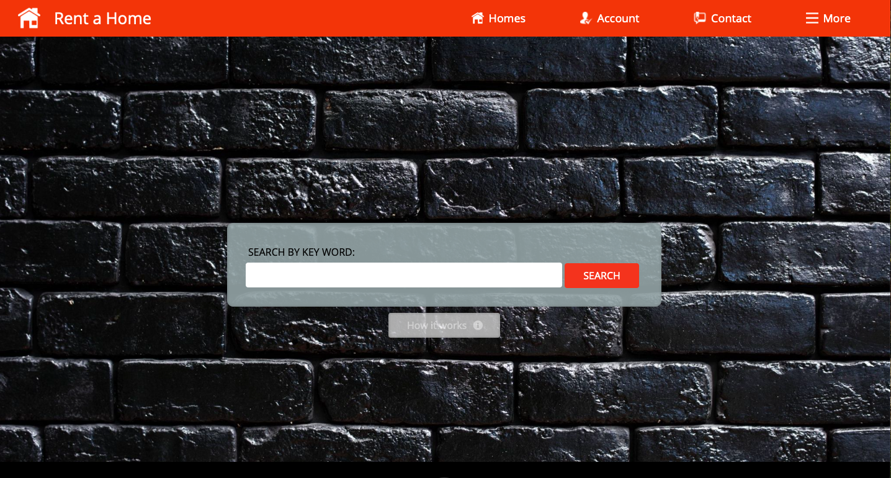
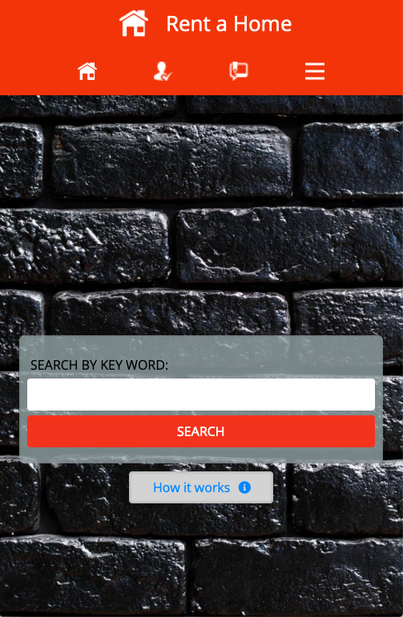
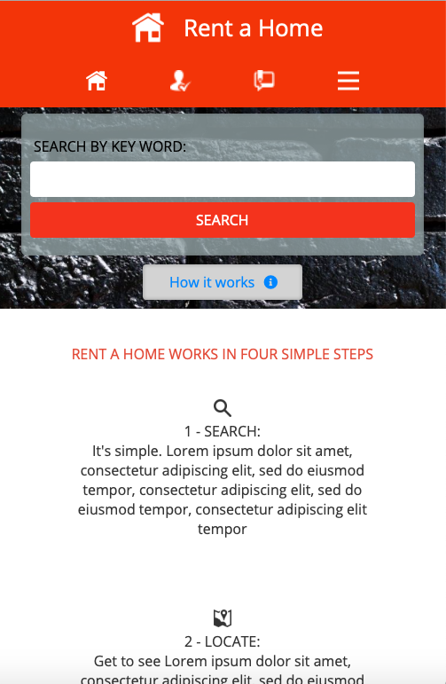
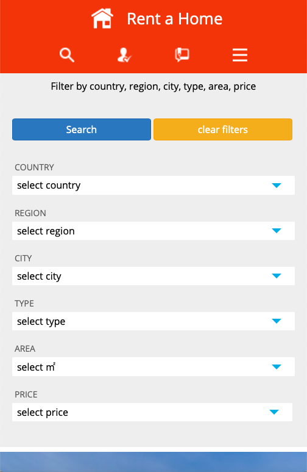
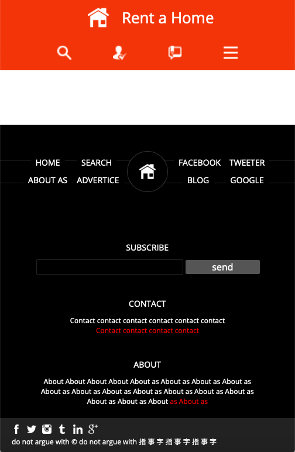
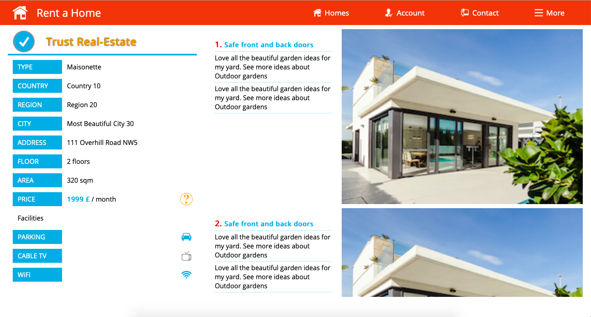
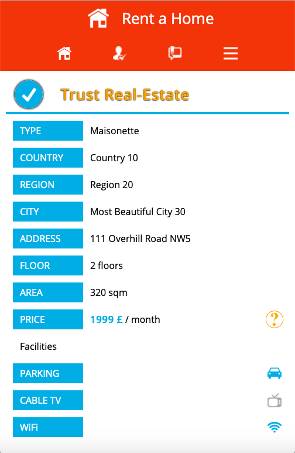
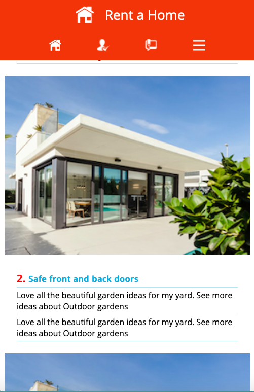

# House Rental - Capstone project
HTML & CSS capstone project is based on an online Directory of Schools, but the specifications suggests to personalize the content and choose between a variety of content types, one of which was “house rental” and this is my choice.
Therefor, I developed this project that demonstrate the management of content of a real-estate agency database using three pages. 

- 1. The main page which represents a search mechanism that links to the 2nd page showing the results of the search.
The page appears showing some animations. One prompts the user to learn about the use of the application.
The navigation menu stands on the top of the screen with buttons that respond on the mouse hover and click.
The search button links to the results page assuming that the user has typed some keywords in the input box.
The results page can be accessed from the menu button labeled Homes as well - the first of the right-side buttons of the navigator.

- 2. The results pages shows links in a grid layout. Three pictures and a panel with critical information represent a link to a house laid out in a smaller grid form. The user accesses the details page by clicking anywhere in each item. The navigator menu contains a Home button on the left side of the navigator and a Search button to move back to the search page. The page provides a number of filters to help the users applying detailed search.

- 3. The details page shows a table on the left with the real-estate firm and information about the location, the type and available facilities of the house. 
On the right side stands a scrolling list of pictures with description in a few paragraphs.
The results page can be accessed by the first of the four right-side buttons on the navigator

- 4. Additionally I included an Under-Construction page that appears when one of the inactive menu buttons is clicked 

The environment	is based on a selection of colours of light green and light blue variations since they are more appropriate for a house rental page, according to the point of view of colours’ psychology and how they affect users. Due to this I provide this link to a relevant article. 
https://www.google.com/amp/s/www.intechnic.com/blog/color-psychology-101-how-color-affects-perception-of-your-website/%3fhs_amp=true 

All pages are designed so they respond to three screen sizes 768 1024 and >1024 by using media queries 

## Video Presentation
[Video](https://www.loom.com/share/33d91cebd86a40b5a0671d7c9486e072)

## Screen Shots

 

 

 

### To build the project I have used pure HTML and CSS
### Environment images are downloaded from White Icons database and 4 sample pictures of a real-estate agency page
## Built With :

- HTML,
- CSS,
- Google Fonts

## Live Demo

[Live Demo Link](https://rawcdn.githack.com/ioanniskousis/Capstone/39ab3992f8ef180cee7ad1f505e16210a6bdd079/index.html)

## Getting Started

To get a local copy up and running follow these simple example steps.

### Prerequisites

#### You should have installed git on your local machine and a text editor preferably VS Code.

### Setup

#### Clone the repository into your local machine.

## 👤 Author
## Ioannis Kousis

- Github: [@ioanniskousis](https://github.com/ioanniskousis)
- Twitter: [@ioanniskousis](https://twitter.com/ioanniskousis)
- Linkedin: [Ioannis Kousis](https://www.linkedin.com/in/ioannis-kousis-9a5051b4/)

## 🤝 Contributing

Contributions, issues and feature requests are welcome!

Feel free to check the [issues page](issues/).

## Show your support

Give a ⭐️ if you like this project!

## Acknowledgments

- Appreciation to my team-mates Phillip, Osong, Abror, Precius and my mentor Mario

## 📝 License

This project is [MIT](lic.url) licensed.
